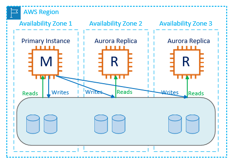

# RDS

### AWS database types

* RDS \(OLTP - online transaction processing\)
  * SQL
  * MySQL
  * PostgreSQL
  * Oracle
  * MariaDB
* NoSQL
  * DynamoDB
* OLAP
  * RedShift
* Cache \(Elasticache\)
  * Memcached
  * Redis

### Backups with RDS

* Automated backups
* Database snapshots

Automated backups allow to recover your database to any point in time with a "retention period". The retention period can be between 1-35 days. Automated backups will take a full daily snapshot and will also store transaction logs throughout the day. When you do a recovery, AWS will first choose the most recent daily backup, and then apply transaction logs relevant to that day. This allows you to do a point-in-time recovery down to a second, within the retention period.

Automated backups are enabled by default. The backup data is stored in S3 and you get free storage space equal to the size of your database. So if you have an RDS instance of 10 Gb, you'll get 10Gb worth of storage.

Backups are taken within a defined window. During the backup window, storage I/O may be suspended while your data is being backed up and you may experience elevated latency.

Database snapshots are done manually. They are stored even after you delete the original RDS instance, unlike automated backups.

Whenever you restore an automated backup or a manual backup, the restored version of the database will be a new RDS instance with a new DNS endpoint.

### Encryption at rest

Encryption at rest is supported for MySQL, Oracle, SQL Server, PostgeSQL, MariaDB and Aurora. Encryption is done using the AWS KMS. Once your RDS instance is encrypted, the data stored at rest in the underlying storage, as are its automated backups, read replicas and snapshots.

#### Sharing encrypted RDS snapshots between accounts

You can share database snapshots that have been encrypted at rest using the AES-256 encryption algorithm. The steps are following:

* Create a custom KMS encryption key.
* Create snapshot using the custom key.
* Share the custom KMS key that was used to encrypt the snapshot.
* Use Console, CLI or RDS API to share the encrypted snapshot with other accounts.

Restrictions:

* You can't share encrypted snapshots as public.
* You can't share Oracle or Microsoft SQL Server snapshots that are encrypted using Transparent Data Encryption \(TDE\).
* You can't share snapshots that has been encrypted using the default AWS KMS encryption key of the AWS account that shared the snapshot.

### Multi-AZ and Replication

Multi-AZ allows you to have an exact copy of your production database in another Availability Zone. AWS handles the replication for you, so when your production database is written to, this write is automatically be synchronized to the standby database. In the event of planned database maintenance, DB instance failure or an AZ failure, RDS will automatically failover to the standby, so that database operations can resume quickly without administrative intervention.

Multi-AZ is for disaster recovery only. It's not primarily used for improving performance. For performance improvement you need **read replicas**. Multi-AZ is available for the following databases:

* SQL Server
* Oracle
* MySQL
* PostgreSQL
* MariaDB
* Aurora \(fault-tolerant by default\)

Read replicas allow you to have a read-only copy of your production database. This is achieved by using asynchronous replication from the primary RDS instance to the replica. You use read replicas primarily for read-heavy database workloads. Read replicas available for the following databases:

* MySQL
* PostgreSQL
* MariaDB
* Oracle
* Aurora

Things to know about read replicas:

* Used for scaling, not for disaster recovery
* Must have automatic backups turned on in order to deploy a read replica.
* You can have up to 5 read replicas of any DB.
* Each read replica will have it's own DNS endpoint.
* You can have read replicas that have multi-AZ.
* You can create read replicas of Multi-AZ databases.
* Read replicas can be promoted to their own databases. This breaks the replication.
* You can have a read replica in another region.

## Aurora

Amazon Aurora is a MySQL-compatible, relational database engine, combines the speed and availability of high-end commercial databases with the simplicity and cost-effectiveness of open-source databases. Amazon Aurora provides up to 5 times better performance than MySQL at a pricepoint 1/10 that of a commercial database while delivering similar performance and availability.

* Starts with 10Gb, scales up to 64Gb.
* Compute resources can scale up to 32 vCPU and 244 Gb of RAM.
* 2 copies of your data is contained in each availability zone with minimum of 3 available zones \(not all regions supported\).

### Scaling

* Aurora is designed to transparently handle the loss of up to 2 copies of data without affecting database write ability and up to 3 copies without affecting read availability.
* Aurora storage is also self-healing. Data blocks and disks are continuously scanned for errors and repaired automatically.

### Replication

* Two types of replicas supported:
  * Aurora replicas \(up to 15\)
  * MySQL replicas \(up to 15\)

### Backups

* Automated backups are always enabled on Aurora instances. Backups do not impact database performance.
* You can also take snapshots with Aurora. This also does not impact performance.
* You can share Aurora snapshots with other AWS accounts.

### Encryption

* Encryption at rest is turned on by default. Once encryption is turned on, all read replicas will be encrypted.

### Failover

* Failover is defined by tiers. The lower the tier the higher the priority with Tier 0 being the highest priority available.

### Cross region replication

* Creating a cross-region replica will also create a new Aurora cluster in the target region. If the replication is disrupted, you will have to set it up again. It is recommended that you select "Multi-AZ deployment" to ensure high availability for the target cluster.

### Aurora Serverless

* Aurora Serverless is an on-demand, auto-scaling configuration for Aurora where the database will automatically startup, shutdown, and scale up or down capacity based on your application needs.
* You pay on a per-second basis for the database capacity you use when the database is active, and you can migrate between standard and serverless configurations with a few clicks in RDS Console.

