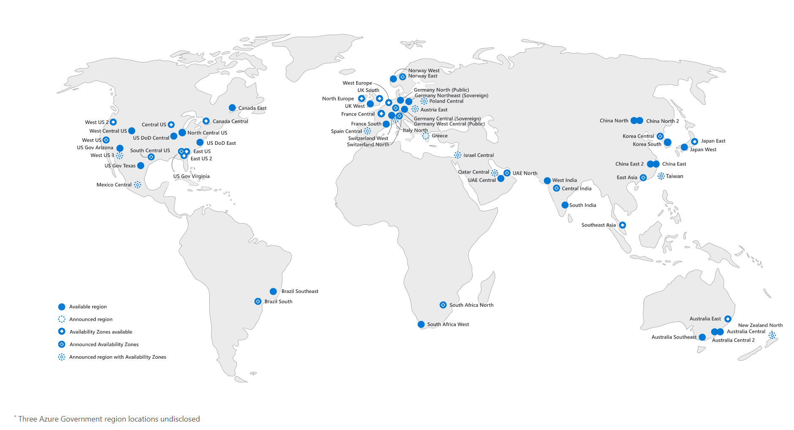

# Organization & Management

### Regions and Availability Zones

* **Region** - a group of data centers in a single geographic location. For example, "Central US", "South India", etc. Provides high availability and fault tolerance. Deployments are closer (geographically) to your end users. Defends against regional outages.
* **Availability Zone** - one of several unique locations in a region. There might be one or more individual data centers per zone. Each zone is self-contained (power, cooling, networking, etc). Availability zone deployments are mainly for fault tolerance, protecting against a single point of failure.

<figure><figcaption></figcaption></figure>

### Azure Resource Manager (ARM)

Centralized management layer - no matter how you connect to Azure, all requests go through ARM to provide access control

* Web portal
* Command-line interface (CLI)
* Application Access
* Access Control (authentication)

### Tenancy

* Everything starts with a single **Azure Tenant**. Single organization instance of Azure AD.
* Each Tenant can have one or more **Management Groups**. Management group serves as a grouping component (optional), central management of multiple subscriptions.
* Each Management Group can have one or more **Subscriptions**. Subscription is a primary billing and access isolation boundary, each subscription has its own billing agreement.
* Each Subscription can have one or more **Resource Groups**. All Azure resources are created in Resource Groups, serve as a container for resources with same purpose/lifecycle.
* Each Resource Group can contain one or more **Resources** (VMs, DBs, Functions, etc).

<figure><figcaption>
Azure Tenant
</figcaption></figure>

### &#x20;

